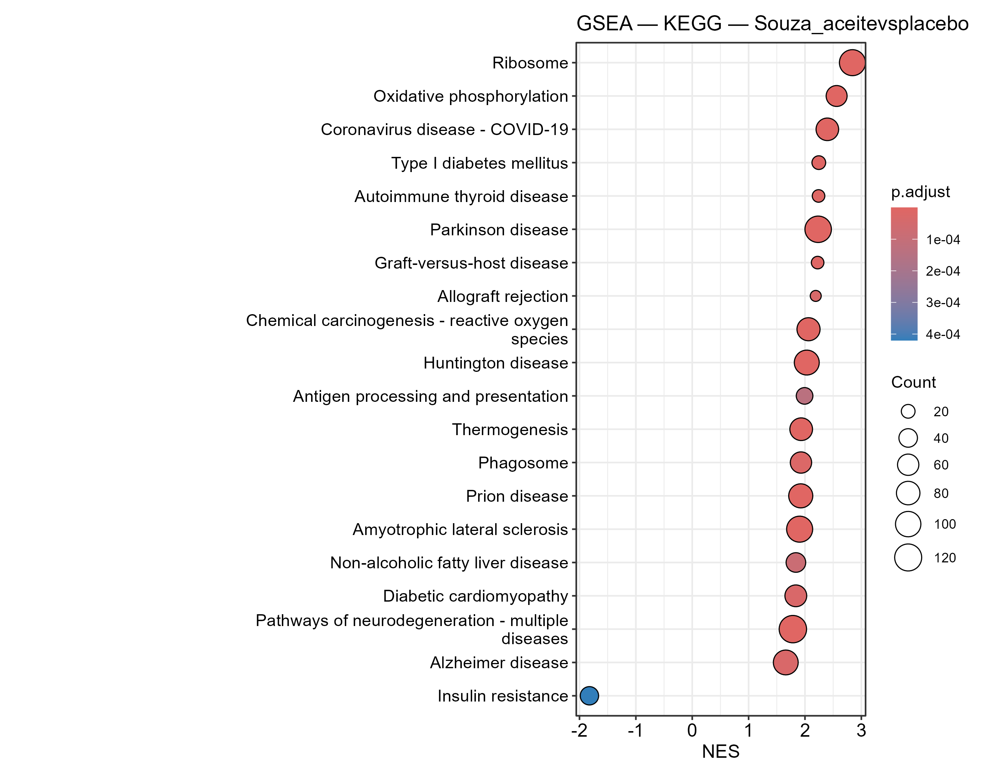
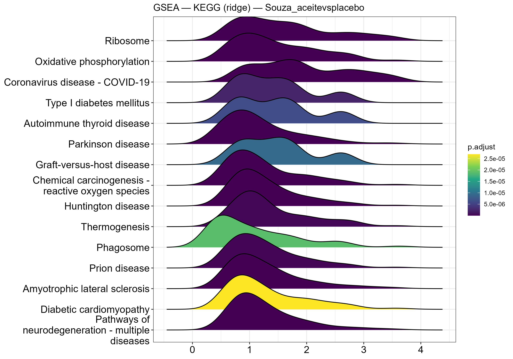
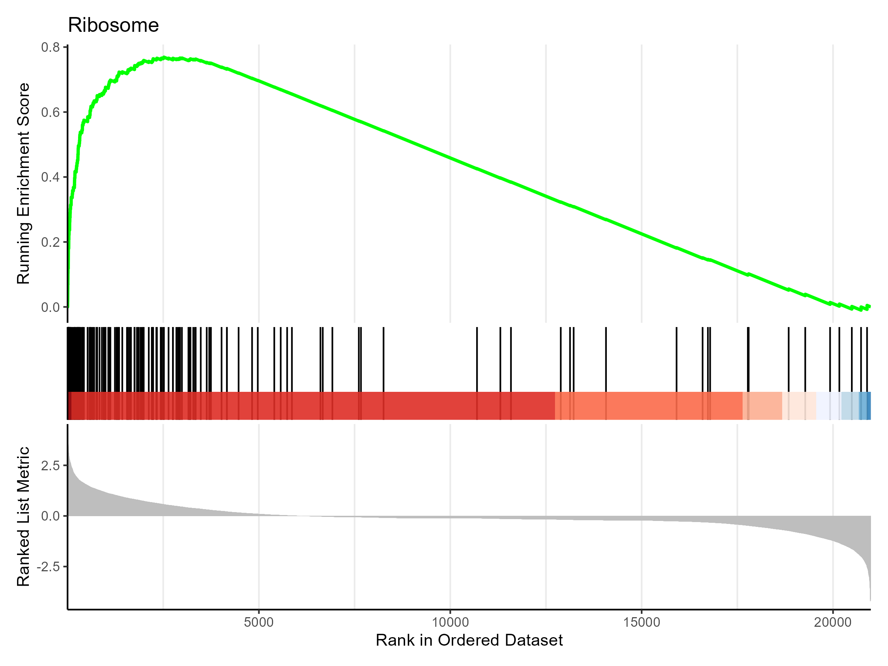

# Figuras_ejemplo

En este documento se recogen algunas figuras que se han ido generando a lo largo del proyecto TFM.

## Expresión génica

## Enriquecimiento funcional

### GeneSet Enrichment Analysis (GSEA)

