# RNA-seq Analysis – Figure Showcase

*Author:* Victor Saavedra Yturriagagoitia

This document contains a small selection of figures from my Master's project, illustrating different steps of RNA-seq analyses and visualizations.

The goal is not to summarize the entire study, but rather to highlight a few representative analyses and interpretations included in this repository.

These examples focus on key visualization and interpretation steps within a typical RNA-seq analysis workflow.

## Example figures

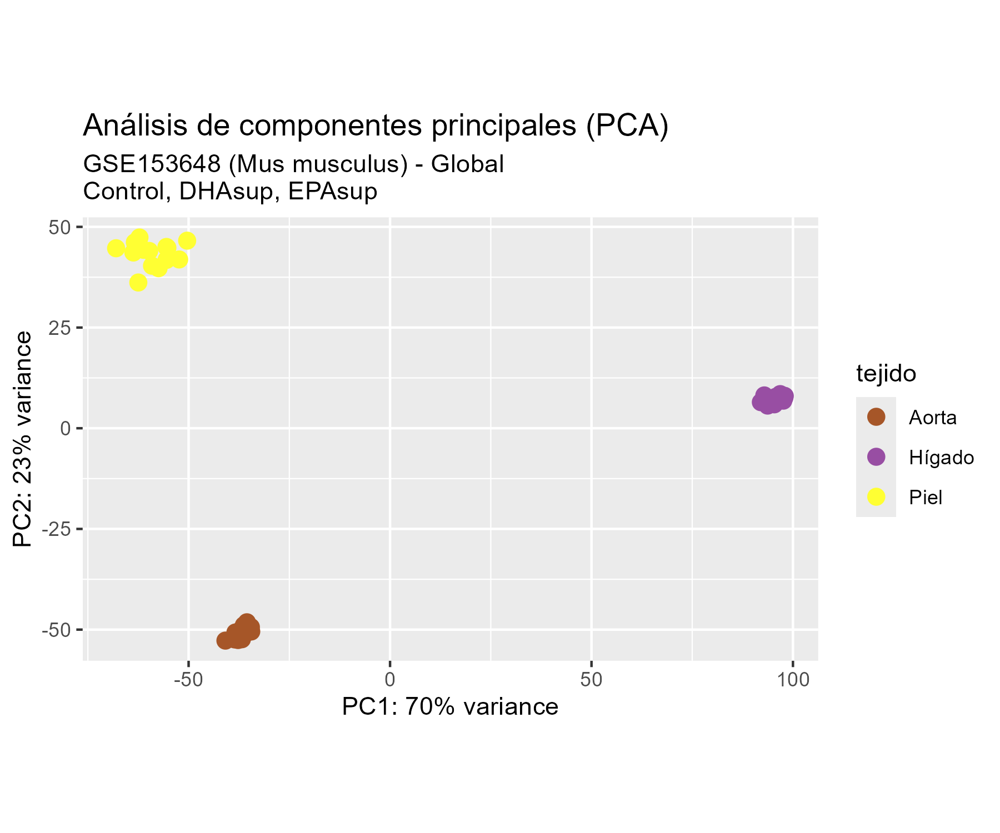
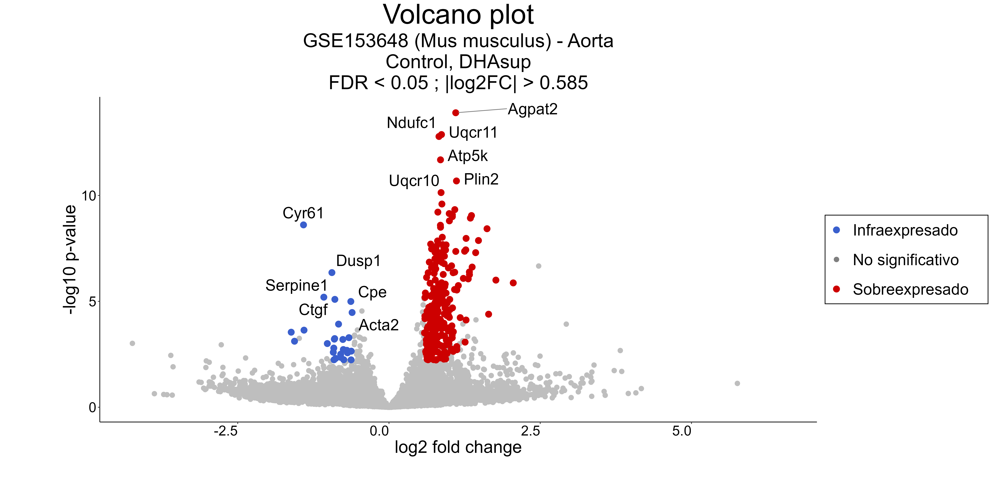
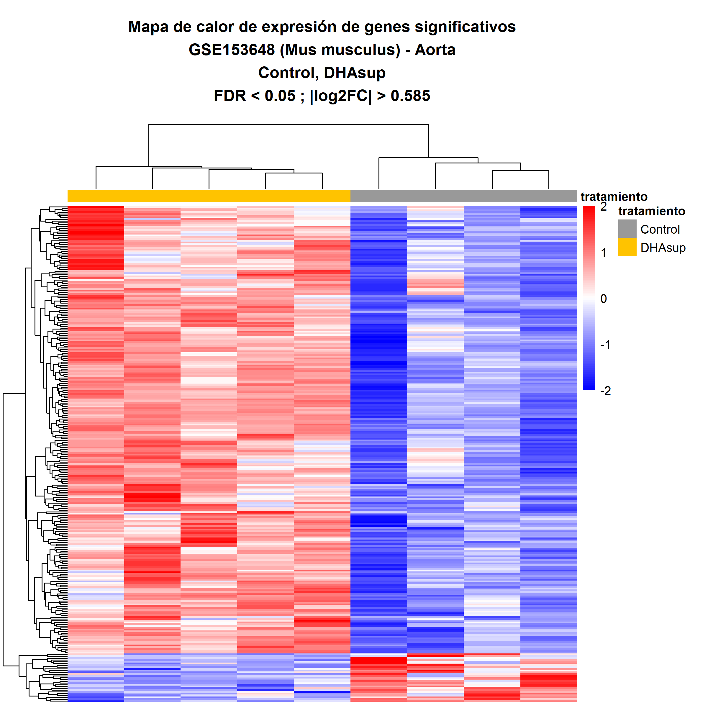
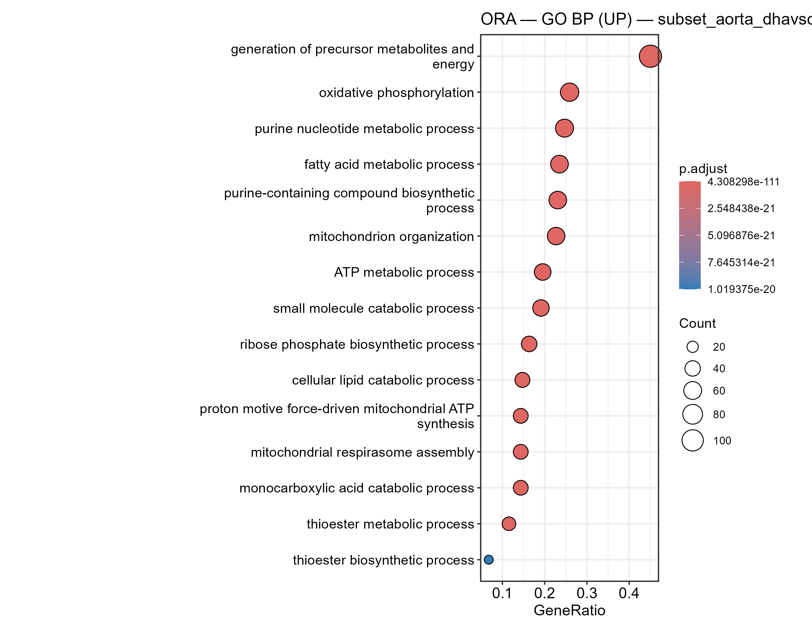
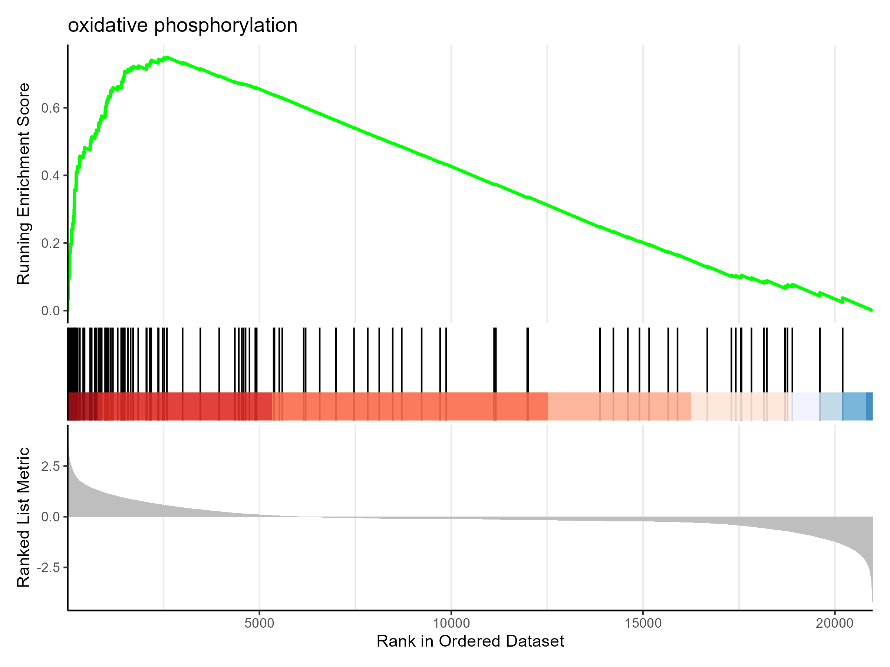  
*Note: The images above are small previews of the figures included in this document. Bigger versions are displayed in the corresponding sections below.*

## Contents

- [Dataset description](#dataset-description)
- [Exploratory analysis: PCA of mouse dataset](#exploratory-analysis-of-transcriptomic-data-pca-of-mouse-dataset)
- [Differential Gene Expression in mouse aorta](#differential-gene-expression-dge-analysis-in-mouse-aorta)
- [Functional enrichment analysis in mouse aorta (ORA)](#functional-enrichment-analysis-in-mouse-aorta-ora)
- [Differential Gene Expression in human blood](#differential-gene-expression-dge-analysis-in-human-blood)
- [Functional enrichment analysis in human blood (GSEA)](#functional-enrichment-analysis-in-human-blood-gsea)
## Dataset description

The datasets were retrieved from the Gene Expression Omnibus (GEO) by searching for publicly available RNA-seq studies related to inflammation and treatment with omega-3-rich oils.   

Two datasets were used in this analysis:  
**GSE153648 (Sorokin 2023)** - Mouse tissues (aorta, liver, skin) from animals supplemented with DHA, EPA or Control [42 samples, 48,709 genes].  
**GSE132648 (Souza 2019)** - Human samples (whole blood) from individuals supplemented with omega-3-rich Oil or Control, following a paired study design [36 samples, 32,591 genes].

### Statistical properties of RNA-seq counts

RNA-seq count data typically exhibit overdispersion and are therefore modeled using a negative binomial distribution in DESeq2. The relationship between mean expression and variance across genes is shown below.

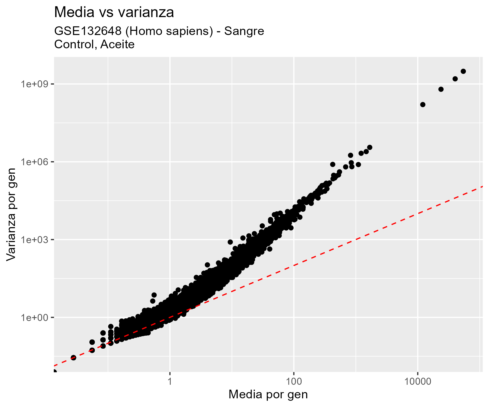

Each point represents a gene, showing the relationship between its mean expression and variance across samples. The dashed line represents the variance expected under a Poisson model (mean = variance). The data is consistent with a negative binomial distribution (variance > mean).

## Exploratory analysis of transcriptomic data: PCA of mouse dataset

To explore the overall structure of the transcriptomic data, I performed a Principal Component Analysis (PCA) on the normalized gene expression matrix. PCA is a dimensionality reduction method that helps visualize the main sources of variance in high-dimensional RNA-seq datasets. By projecting samples into a lower-dimensional space, it becomes easier to detect patterns such as clustering of samples or separation between biological conditions. 

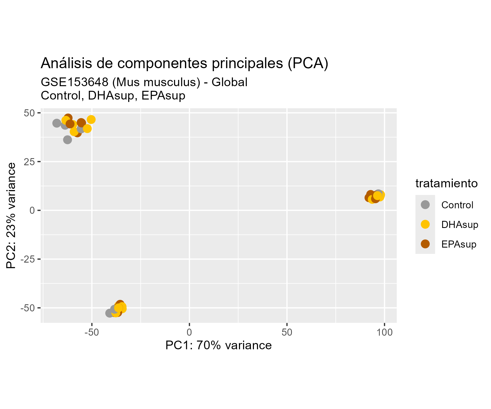  
Left: colors represent different tissues; Right: colors represent different supplementations.  
Legend: <i>Hígado</i>: liver; <i>Piel</i>: skin.

The first two principal components captured most of the variance in the dataset and revealed a clear grouping of samples by tissue type (aorta, liver, skin). This indicates that tissue-specific gene expression programs are the main source of variability in the data. In contrast, treatment conditions (Control, DHA, EPA) did not produce a clear separation in this PCA space. 

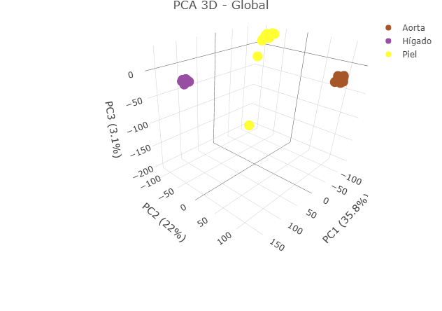
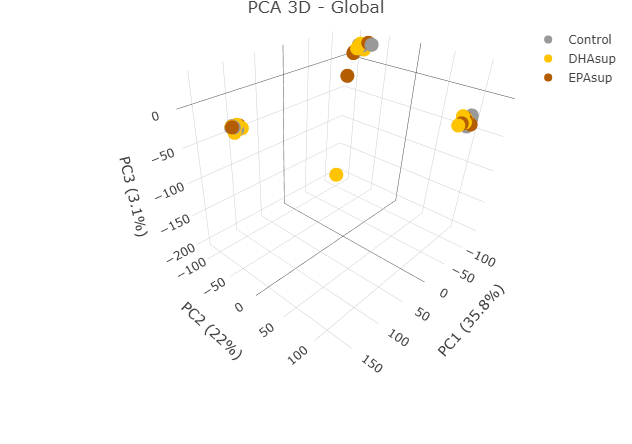  
Left: colors represent different tissues; Right: colors represent different supplementations.  
Legend: <i>Hígado</i>: liver; <i>Piel</i>: skin.

Adding a third principal component did not resolve the treatment groups at the level of the global transcriptome. However, the PCA suggests differences in sample heterogeneity between tissues. Skin samples appear more dispersed, indicating higher transcriptomic variability, while aorta and liver samples form tighter clusters, consistent with more homogeneous expression profiles within these tissues.

## Differential Gene Expression (DGE) Analysis in mouse aorta

To identify transcriptional changes associated with omega-3 supplementation, I performed a DGE analysis using the library DESeq2. This approach compares normalized RNA-seq counts between experimental groups and estimates the magnitude and statistical significance of expression changes for each gene.

Volcano plots summarize the results of the differential expression analysis. In these plots, each point represents a gene, positioned according to its log2 fold change (x-axis) and statistical significance expressed as −log10 adjusted p-value (y-axis). This representation allows an intuitive identification of genes that show both large expression changes and strong statistical support.

In the aorta dataset, supplementation with DHA resulted in 278 significantly differentially expressed genes (251 upregulated and 27 downregulated) compared with the Control group. In contrast, EPA supplementation produced 109 significant genes, including 99 upregulated and 10 downregulated genes. These results suggest a stronger transcriptomic response in aortic tissue under DHA supplementation compared with EPA.

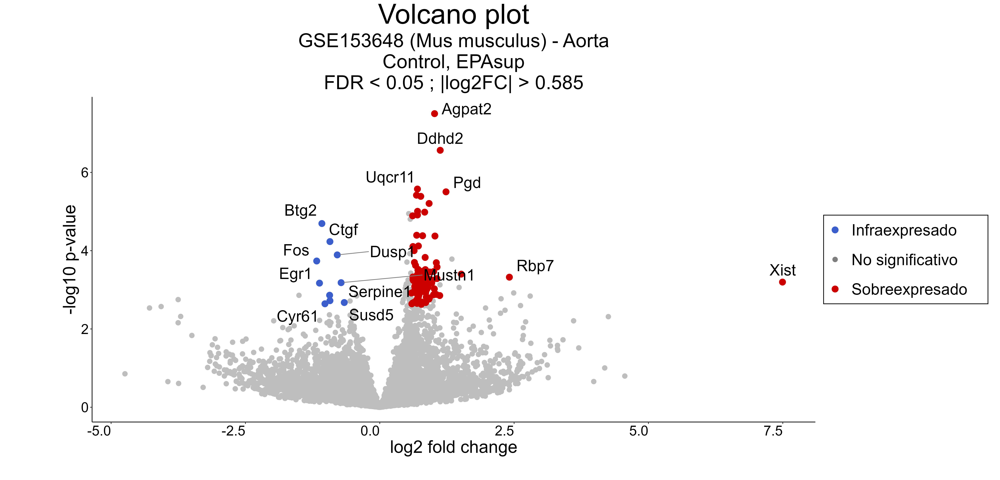  
Left: supplementation with DHA vs Control; Right: supplementation with EPA vs Control.  
Legend: <i>Infraexpresado</i>: under-expressed; <i>No significativo</i>: non-significant; <i>Sobreexpresado</i>: over-expressed.

To further explore these transcriptional patterns, I generated heatmaps showing the expression profiles of significant genes across samples. Heatmaps display normalized gene expression values and apply hierarchical clustering to group both genes and samples according to similarity in their expression patterns.

The heatmaps reveal a clear separation between treatment and control samples, reflecting consistent transcriptional changes induced by omega-3 supplementation. Samples cluster according to their treatment condition, while genes with similar expression patterns are grouped together, highlighting coordinated transcriptional responses.

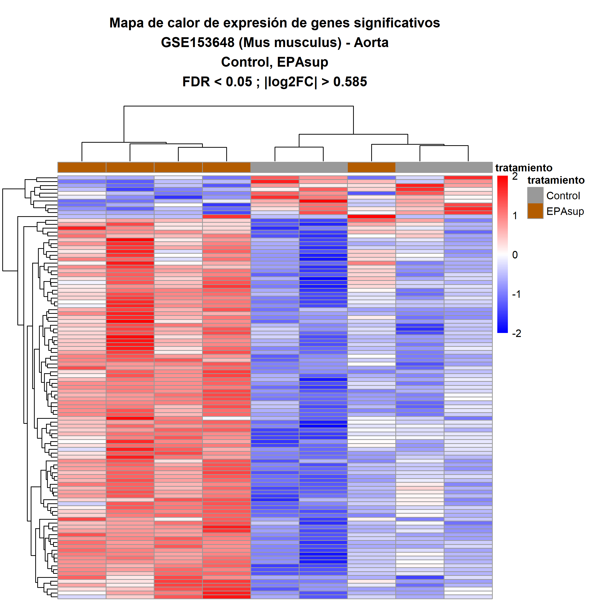  
Left: supplementation with DHA vs Control; Right: supplementation with EPA vs Control.

**Extended versions of the heatmaps with full gene labels are available below:**

<b>Show extended heatmap with 278 gene labels (DHA vs Control)</b>

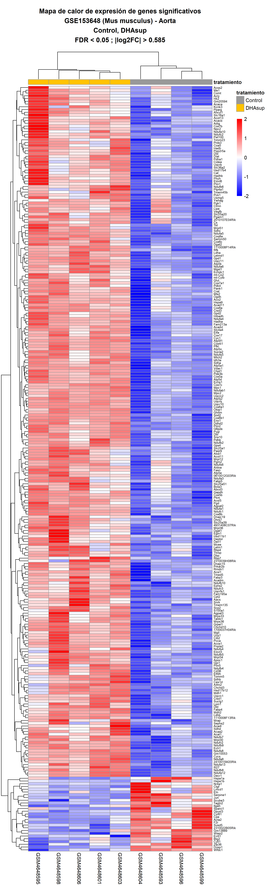

 

<b>Show extended heatmap with 109 gene labels (EPA vs Control)</b>

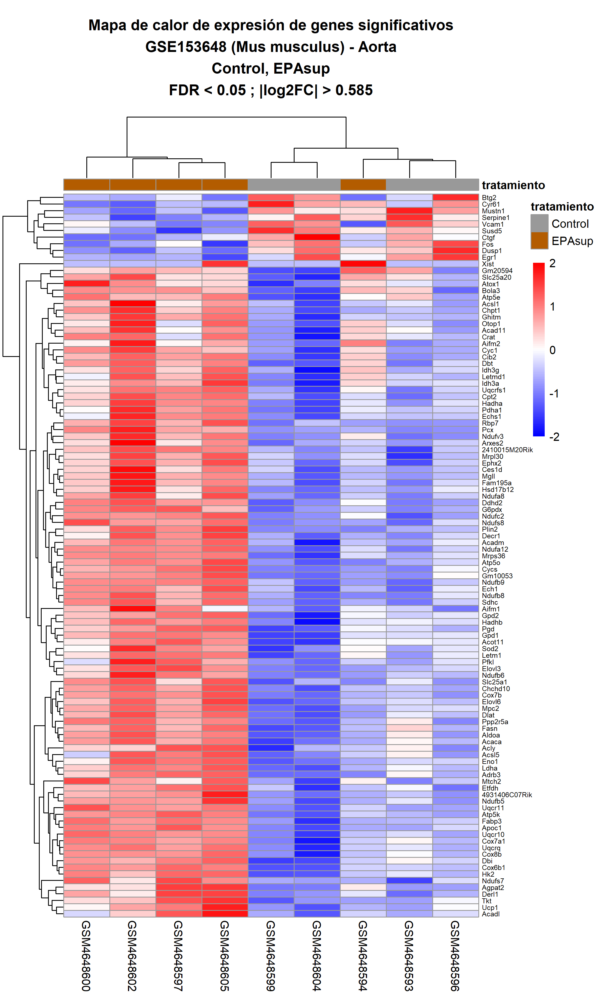

## Functional Enrichment Analysis in mouse aorta: ORA
The mouse aorta dataset yielded a relatively large number of significantly differentially expressed genes. Therefore, I applied an Over-Representation Analysis (ORA) using Gene Ontology (GO) Biological Process terms to identify enriched biological pathways.

The dotplot below summarizes the enriched GO Biological Process terms among the 278 genes upregulated in the DHA vs Control comparison in mouse aorta. Each dot represents one biological process, where the size indicates the number of genes associated with that term and the color reflects the statistical significance (adjusted p-value).

The enriched biological processes are mainly related to mitochondrial function and energy metabolism, such as oxidative phosphorylation and ATP metabolic processes. These results suggest that DHA supplementation may promote metabolic and mitochondrial activity in mouse aortic tissue.

### Enrichment map

To further visualize relationships between enriched GO terms, I generated an enrichment map. In this network representation, each node corresponds to a biological process and edges connect terms that share genes. This allows related processes to cluster together, helping identify broader functional themes emerging from the analysis.

<table>
<tr>
<td style="background:white; padding:10px;">
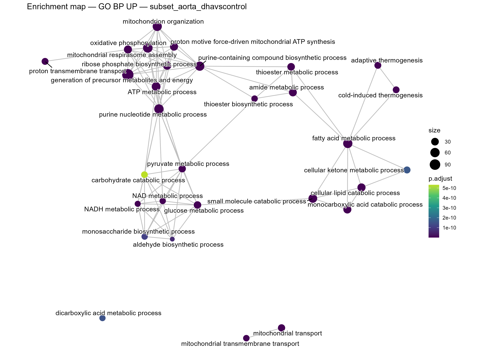
</td>
</tr>
</table>

 
Most enriched terms cluster around mitochondrial function and energy metabolism, including oxidative phosphorylation and ATP metabolic processes. Additional terms related to fatty acid metabolism suggest a coordinated metabolic response. Overall, these patterns indicate that DHA supplementation is associated with increased mitochondrial and metabolic activity in mouse aortic tissue.

### Gene-concept network (cnetplot)

Finally, I generated a gene-concept network to visualize how individual genes contribute to multiple enriched biological processes. In this plot, GO terms are connected to the genes associated with them, and gene colors reflect their log2 fold change. This representation highlights genes that may participate in several related metabolic pathways.

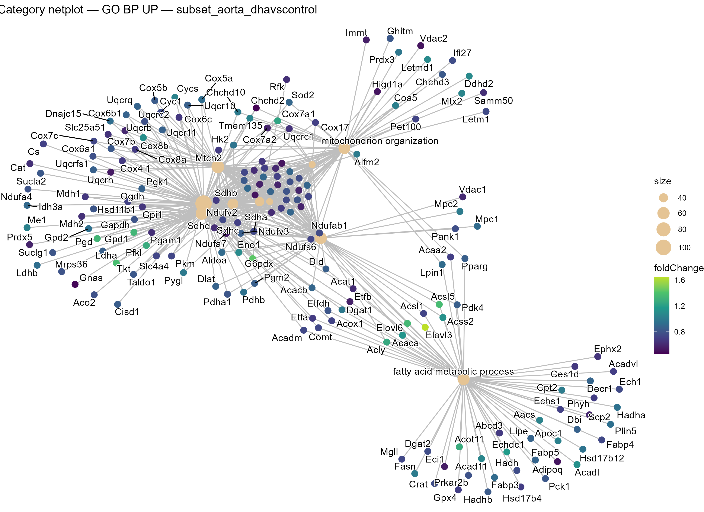

 
The gene-concept network shows how individual genes contribute to several enriched biological processes. Many genes are shared between mitochondrial and energy metabolism terms, indicating coordinated regulation of oxidative and ATP-producing pathways. A separate cluster of genes associated with fatty acid metabolism further suggests metabolic reprogramming in response to DHA supplementation.

 

## Differential Gene Expression (DGE) Analysis in human blood

Using the same DGE analysis strategy described for the mouse dataset, I analyzed RNA-seq data from human whole blood samples to identify transcriptional changes associated with omega-3 supplementation.

A total of 15 genes were identified as significantly differentially expressed between the Oil and Control conditions, including 2 upregulated and 13 downregulated genes. The volcano plot is consistent with this relatively modest transcriptional response, as most genes cluster near log2 fold change zero and only a small number reach the significance threshold.

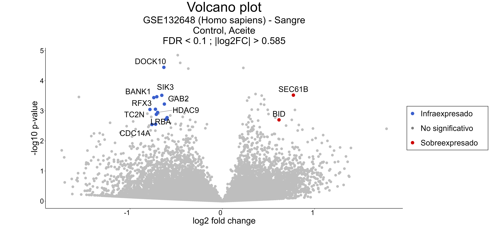  
Legend: <i>Infraexpresado</i>: under-expressed; <i>No significativo</i>: non-significant; <i>Sobreexpresado</i>: over-expressed.

In the heatmap, several Control samples cluster together, suggesting consistent expression patterns among individuals in the control condition. In contrast, samples from the Oil supplementation group show slightly more dispersed expression profiles, reflecting inter-individual variability in the transcriptional response.

The paired plots illustrate how gene expression changes occur within each individual between the two conditions. For several genes, most individuals show expression shifts in the same direction, supporting the differential expression signal detected by the statistical analysis. Because the study follows a paired experimental design, inter-individual variability is controlled in the statistical model, increasing the power to detect consistent expression changes across individuals. As a result, genes that might not appear significant in an unpaired analysis can reach statistical significance in this paired framework.

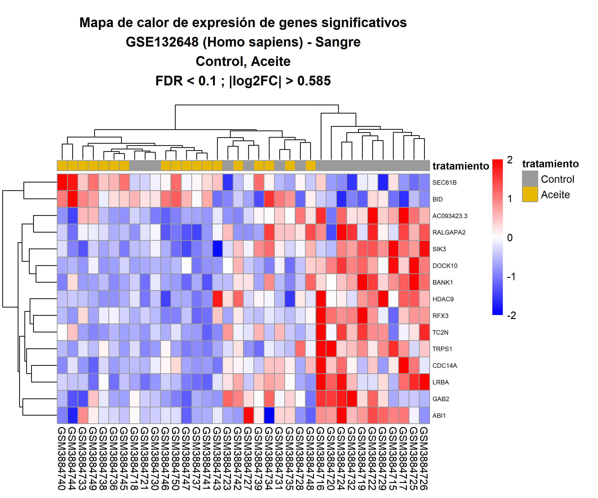
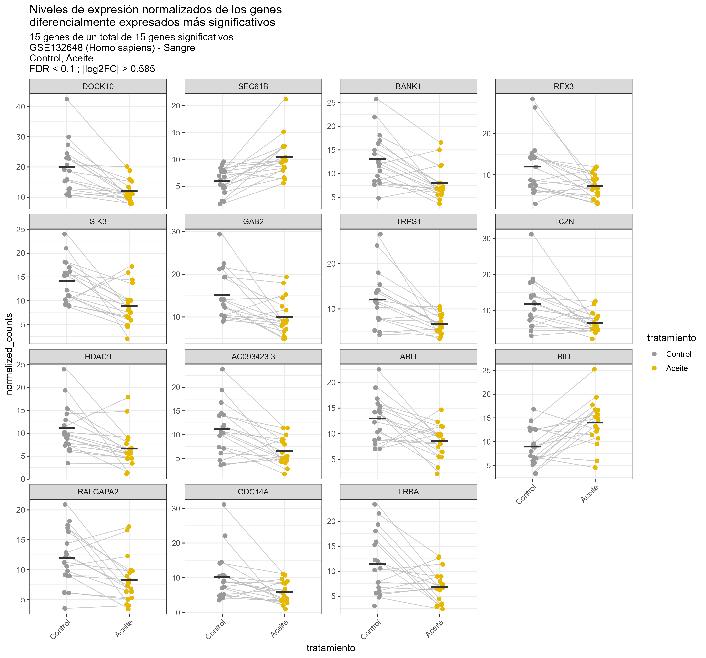  
Legend: <i>Aceite</i>: Oil

As an alternative visualization, the same expression differences can also be represented using violin plots, which illustrate the distribution of normalized expression values across experimental groups. These plots display the same individual data points shown in the paired plots, but summarized as distributions for each condition. While violin plots provide an overview of expression variability, the paired plots above more directly reflect the matched-sample comparisons used in the analysis.

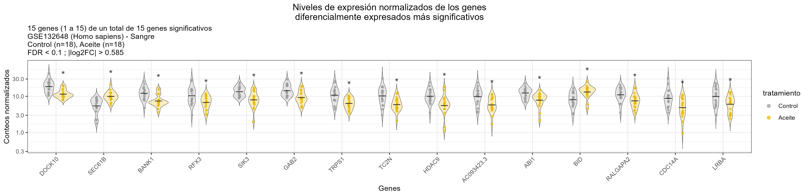  
Note: Each point corresponds to an individual sample included in the paired analysis. The significance stars reflect the statistical significance calculated under the paired study design.

## Functional Enrichment Analysis in human blood: GSEA

The human dataset yielded only a small number of significantly differentially expressed genes. Therefore, I applied Gene Set Enrichment Analysis (GSEA) using Gene Ontology (GO) Biological Process terms to identify coordinated changes at the pathway level.

The dotplot summarizes the most enriched biological processes identified in the Oil vs Control comparison. Each dot represents a GO term, where the x-axis corresponds to the normalized enrichment score (NES), the size indicates the number of genes contributing to the enrichment, and the color reflects the adjusted p-value.

The ridgeplot provides an alternative visualization of the same enrichment results by displaying the distribution of gene-level statistics for each enriched pathway across the ranked gene list.

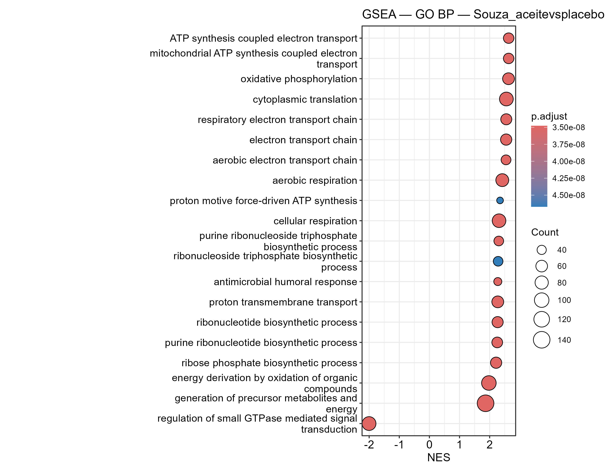
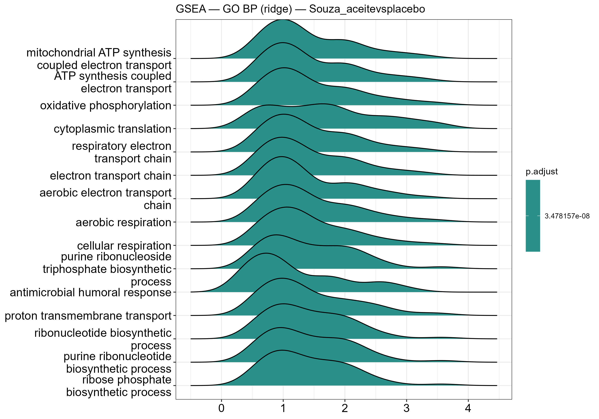

The enriched pathways are strongly associated with mitochondrial respiration and cellular energy metabolism, including oxidative phosphorylation, electron transport chain activity, and ATP synthesis. The presence of multiple closely related terms reflects the coordinated activation of mitochondrial energy-producing pathways.

To further illustrate these enrichment patterns, the enrichment curves for the three most enriched GO terms are shown below. These plots display how genes belonging to each pathway accumulate at the top of the ranked gene list, producing a positive enrichment signal in the Oil supplementation condition.

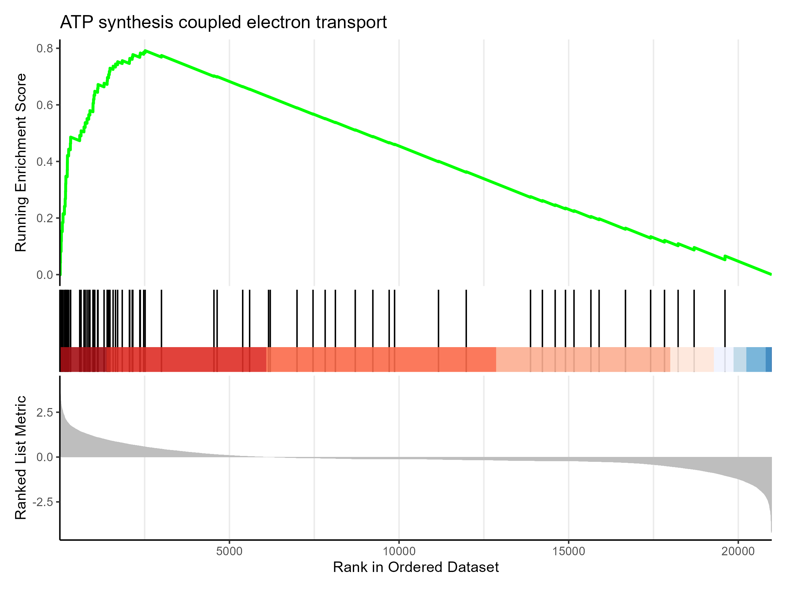
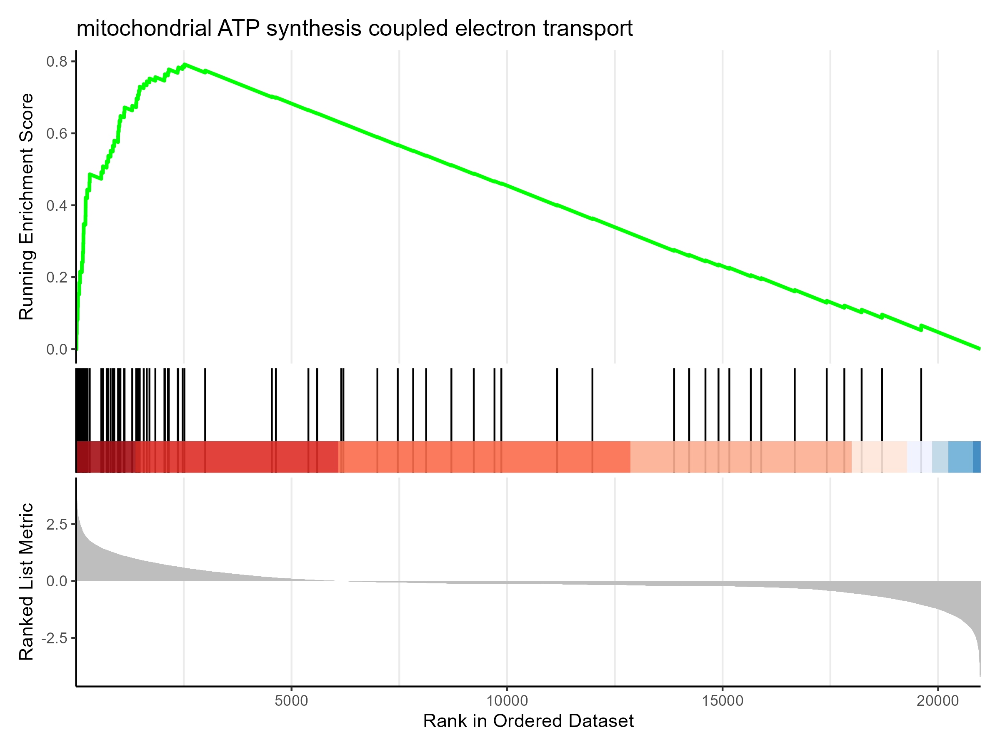

The enriched pathways show almost identical adjusted p-values and gene distribution profiles across the ranked gene list. This reflects the redundancy of Gene Ontology terms, as many enriched categories correspond to closely related mitochondrial processes and therefore share a large proportion of genes.

Overall, the GSEA results indicate that omega-3 supplementation in human blood is associated with coordinated transcriptional changes in mitochondrial and oxidative metabolic pathways, consistent with the metabolic patterns observed in the mouse dataset.
